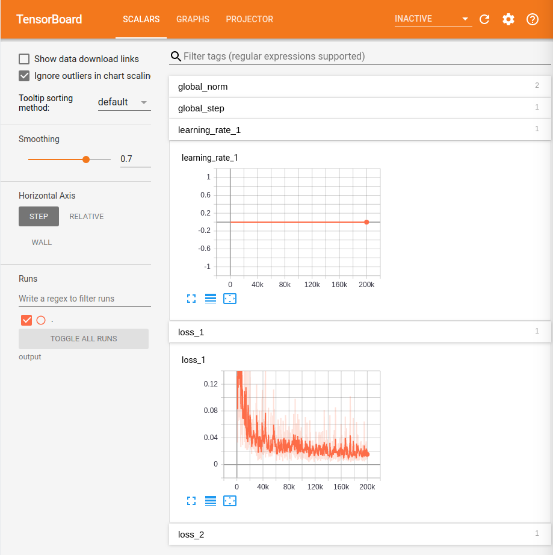

# Training a Waste Detector in tensorflow

## Recyclable Dataset
The dataset is collection of 14122 images and four categories of glass, paper, metal and platistic. The detailed informaiton can be found in the folder [Haihua-Trash-Data](./Haihua-Trash-Data). You can Download the dataset in png format and in tfrecord format from [Baidu Cloud Disk](https://pan.baidu.com/s/1phli_jXif7ozPMJ1Atv43Q). Please contact us for the access code if you want to use the dataset.

## Tensorflow Object Detection API
The TensorFlow Object Detection API is an open source framework built on top of TensorFlow that makes it easy to construct, train and deploy object detection models. The original website is [here](https://github.com/tensorflow/models/tree/master/research/object_detection)

Since some of the models in this API are not updated with the tensorflow 2.0 release. We'll use tensorflow 1.15 for the waste sorting projects so that we can make use of the model zoo.

### Installation

``` bash
# Create a conda environment with tensorflow 1.15, skip this step if you have created before
conda create --name tf1.15 python=3.7
conda activate tf1.15
# Use tensorflow==1.15.0 if you don't have GPU on your computer
pip install tensorflow-gpu==1.15.0
```

``` bash
# Install dependency
pip install Cython numpy contextlib2 pillow lxml matplotlib pycocotools
```

When running locally, the ME336/Week13 Waste Sorting Optimization/ and ME336/Week13 Waste Sorting Optimization/slim directories should be appended to PYTHONPATH. This can be done by adding the following line to ~/.bashrc

``` bash
# From tensorflow/models/research/
export PYTHONPATH=$PYTHONPATH:`path-to-ME336/Week13 Waste Sorting Optimization`:`path-to-ME336/Week13 Waste Sorting Optimization`/slim
```

## Get Started

### Preparing Dataset
Download the training dataset in png format from [Baidu Cloud Disk](https://pan.baidu.com/s/1phli_jXif7ozPMJ1Atv43Q) with 4fy5 and extract it under ./simple_recyclable. Then convert the dataset into tfrecord format. The codes will produce 5 files recyclable-trash-tfrecords-0*-of-05.tfrecord.

``` bash
# from ME336/Week13 Waste Sorting Optimization/Haihua-Trash-Data
python create_recyclabletrash_tf_record.py \
      --image_dir="simple_recyclable" \
      --object_annotations_file="simple_recyclable/train.json" \
      --output_file_prefix="recyclable-trash-tfrecords" \
      --num_shards=5
```

### Start train a waste detector using faster rcnn
We finetune a faster rcnn model provided by the API. First Download the pretrained checkpoint and extract it.
``` bash
wget http://download.tensorflow.org/models/object_detection/faster_rcnn_resnet101_coco_2018_01_28.tar.gz
tar -xvf faster_rcnn_resnet101_coco_2018_01_28.tar.gz
```

Run the training script. The training configuration is in the file data_trash/faster_rcnn_resnet101_trash.config. Hyper parameters like number of classes, batch_size, learning rate, and training steps can be specified here.
``` bash
# from ME336/Week13 Waste Sorting Optimization/object_detection
python model_main.py \
      --model_dir output \
      --pipeline_config_path data_trash/faster_rcnn_resnet101_trash.config \
      --num_train_steps 200000
```

### Monitor progress with Tensorboard
You can monitor progress of the training by running Tensorboard on your local machine:
``` bash
# ME336/Week13 Waste Sorting Optimization/object_detection
tensorboard --logdir=output
```
Once Tensorboard is running, navigate to localhost:6006 from your favourite web browser. You should see something similar to the following:



### Exporting the Tensorflow Graph
After your model has been trained, you should export it to a Tensorflow graph proto. First, you need to identify a candidate checkpoint to export under output folder. The checkpoint will typically
consist of three files:

* `model.ckpt-${CHECKPOINT_NUMBER}.data-00000-of-00001`
* `model.ckpt-${CHECKPOINT_NUMBER}.index`
* `model.ckpt-${CHECKPOINT_NUMBER}.meta`

Run the following command from ME336/Week13 Waste Sorting Optimization/object_detection
```bash
python export_inference_graph.py \
    --input_type image_tensor \
    --pipeline_config_path data_trash/faster_rcnn_resnet101_trash.config \
    --trained_checkpoint_prefix output/model.ckpt-200000 \
    --output_directory exported_graphs
```
Afterwards, you should see a directory named `exported_graphs` containing the
SavedModel and frozen graph.

### Run a realtime detector using realsense
Congratulations, you have now trained an object detector for waste sorting. Next, we will test the exported model using realtime image stream from realsense.

Following the instructions to install [SDK](https://www.intelrealsense.com/sdk-2/) for realsense and install the python dependency.
``` bash
pip install pyrealsense2
```

Connect the realsense D435 to your computer and run the following command
``` bash
# ME336/Week13 Waste Sorting Optimization/object_detection
python object_detection_realsense.py
```
You will have a real-time detecion window on your screen as below:


## TODOs

You are required to finetune your own model probablely from the [model zoo](https://github.com/tensorflow/models/blob/master/research/object_detection/g3doc/detection_model_zoo.md).
