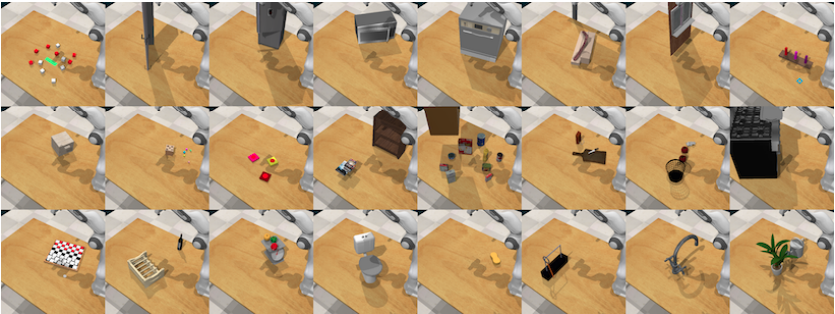
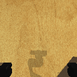
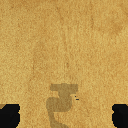
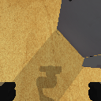
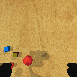
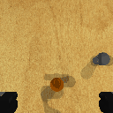
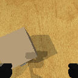
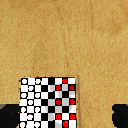

# Week 15 Final Presentation
The submitted materials are code, video, and essay.

## RLBench (Robot Learning Benchmark)
offical website: https://sites.google.com/view/rlbench   
GitHub: https://github.com/stepjam/RLBench   
paper: https://arxiv.org/pdf/1909.12271.pdf   

RLBench is benchmark for robot learning, it provides a standard virtual environment and various tasks.



## install
RLBench is built around [PyRep](https://github.com/stepjam/PyRep) and CoppeliaSim. Make sure you have install them, the install RLBench:

```
git clone https://github.com/stepjam/RLBench.git
cd RLBench
conda activate pyrep
pip3 install -r requirements.txt
python3 setup.py install
```
Now, you can use RLBench.

## Example
Move the test_opendoor.py to RLBench/examples, and run the OpenDoor example.
```
cd examples
python test_opendoor.py
```

## Choose your task
The RLBench provides about 100 tasks, and the tasks are listed in folder RLBench/rlbench/tasks. Choose a task, describe it, explain the reason, complete the code, and finish the paper. There are some tasks suggested:
- push button   

- press switch   

- slide block to target   

- stack blocks   

- block pyramid   

- close door   

- pick and lift   

- pick up cup   

- open drawer   

- set up checkers   


More tasks demos can be found in https://drive.google.com/drive/folders/1TqbulbbCEqVBd6SBHatphFlUK2JQLkYu
